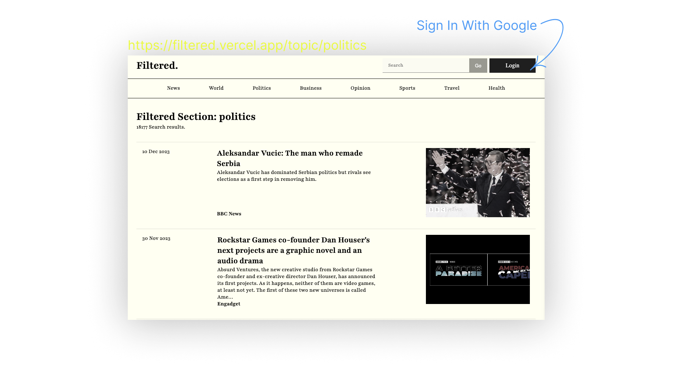
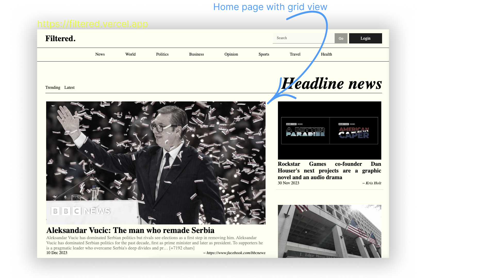
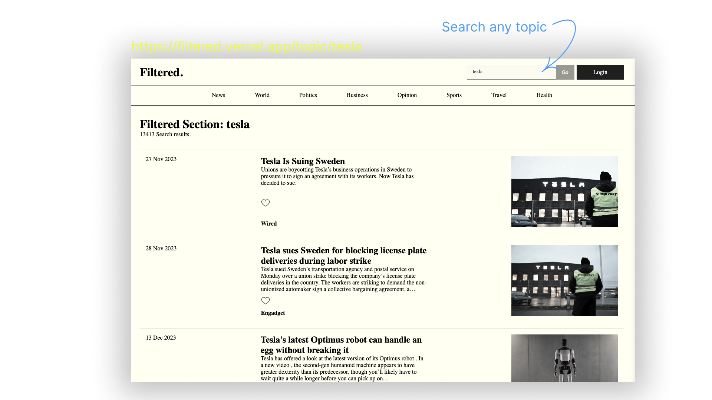

# Filtered.


## Tech Stack

- `Next.Js`
- `Typescript`
- `Firebase`
- `Newsapi` - [Link](https://newsapi.org)

## Setting up locally

- Clone the Repository

```bash
  git clone https://github.com/siddhantprateek/filtered.git
  cd filtered # Navigate to the Project Directory
```
**Install Dependencies**

```bash
  npm install 
  # or
  bun install
```

**Set Up Firebase environment variable**

- Create a new project on the [Firebase Console](https://console.firebase.google.com/).
- In the project settings, find and copy the configuration values for the web app.
- Create a `.env.local` file in the project root and add the following:

```bash
NEXT_PUBLIC_FIREBASE_API_KEY=your-api-key
NEXT_PUBLIC_FIREBASE_AUTH_DOMAIN=your-auth-domain.firebaseapp.com
NEXT_PUBLIC_FIREBASE_PROJECT_ID=your-project-id
NEXT_PUBLIC_FIREBASE_STORAGE_BUCKET=your-storage-bucket.appspot.com
NEXT_PUBLIC_FIREBASE_MESSAGING_SENDER_ID=your-messaging-sender-id
NEXT_PUBLIC_FIREBASE_APP_ID=your-app-id
NEXT_PUBLIC_FIREBASE_MEASUREMENT_ID=your-measurement-id
NEXT_PUBLIC_NEWS_APIKEY= # Set Up News API Key
```


**Run the Development Server:**

```bash
   npm run dev
  #  or if you're using Yarn:
  yarn dev
   #  or if you're using Bun:
  bun run dev
```

## MockUps

- Sign In with Google Account



- Grid View of Home Page



- Search Any Topics




**Open in Browser:**

Open [http://localhost:3000](http://localhost:3000) in your web browser to view the application.


### Author 
[Siddhant Prateek Mahanayak](https://github.com/siddhantprateek)